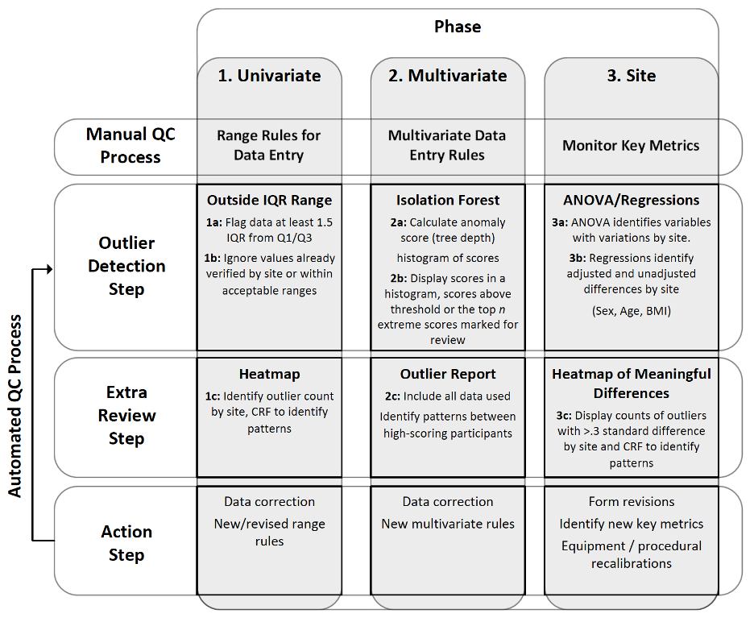

```{r, include = FALSE}
library(isotree)
library(dplyr)
library(kableExtra)
knitr::opts_chunk$set(
  collapse = TRUE,
  comment = "#>",
  warning = FALSE,  # turn on to debug
  message = FALSE
)
```

## Introduction to BulkQC

This tutorial covers the basic usage of the `BulkQC` package. `BulkQC` helps you find outliers in multisite clinical trials.

The package is intended to be used as a three-step collaboration between data coordinating centers and clinical sites. Each step has an associated function in the `BulkQC` package that identifies a particular type of possible outlier. The data coordinating center should discuss the results of the first function and clean the data accordingly before proceeding with the second step, and likewise discuss the results of the second step and remove real outliers before finishing with step three.

{width="600"}

-   In the paper associated with this package we apply the algorithm to data collected in the Molecular Transducers of Physical Activity Consortium (MoTrPAC) study. To read the full paper see [Coming Soon](motrpac.org).

We've included 3 randomly generated dataframes (`GRIP`, `CPET`, `HWWT`) that mimic what you might see in a multisite clinical trial. The column `pid` contains a unique participant identifier and the column `site` identifies which clinical site the patient belongs to.

```{r}
library(BulkQC)
table_names <- c("CPET","GRIP","HWWT")
kable(head(CPET))
```

There are 3 main analyses performed by BulkQC:

-   **Individual Univariate Outliers**. Simple outliers defined by a single observation being too high or low.
-   **Individual Multivariate Outliers**. Outliers defined by an anomalous set of variables. These variables would not trigger phase 1's univariate testing, but something is fishy about the combination of variables.
-   **Site-level Outliers**. Site-level differences in a variable.

## Using the Package

#### Individual Univariate Outliers

First, participant-level data are examined in a univariate approach separately for all variables in the study. Values at the extreme tails of the distribution of each variable are deemed potential outliers and discussed with the originating site. To find these potential outliers we use the `individual_univariate_outliers` function. As with all three steps in BulkQC, we provide the function with a list of tables, an optional vector of table names, an identifying variable for participants, an identifying variable for clinical sites, and an optional quantity of outliers to report. If no list of table names is provided, the function defaults to `A,B,C,…,Z` and if no quantity of outliers is provided then all of them will be returned.

```{r indivdiual-univariate}
i_u_outliers <- individual_univariate_outliers(crfs = list(CPET, GRIP, HWWT), 
                                               crf_names = table_names,
                                               id_var = "pid",
                                               site_var = "site")
kable(head(i_u_outliers,1))
```

VO2 of 150 has been identified as a potential outlier that should be discussed with the clinical site responsible for the data. For purposes of this example we will change it to `NA` before continuing to phase 2. 

```{r}
CPET[11,"vo2"] <- NA
```


#### Individual Multivariate Outliers

Second, participant-level data are examined in a multivariate approach for meaningful groups of variables, e.g., repeated measurements of related variables such as weight, BMI, or heart rate. As in phase 1, we provide the function with a list of tables, an optional vector of table names, an identifying variable for participants, an identifying variable for clinical sites, and an optional quantity of outliers to report. Potential outliers are identified using isolation forests and again discussed with clinical sites.

The anomaly scores returned from `individual_multivariate_outliers` are unitless measures in the range `[0,1]` with scores closer to 1 having a higher chance of being an outlier. The anomaly score is not a percentage. In the example below we plot all the anomaly scores as a histogram and note that one observation may be weak outliers.

```{r individual-multivariate}
i_m_outliers <- individual_multivariate_outliers(
  crfs = list(CPET, GRIP, HWWT),
  crf_names = table_names,
  id_var = "pid",
  site_var = "site")
kable(head(i_m_outliers, 2), digits=2)
```

```{r}
library(ggplot2)
qplot(i_m_outliers$score, geom="dotplot")
```

Looking at the top outlier, we can see that the participant's height is 51 inches and their weight is 297 pounds. While neither of these values triggered the inidivual univariate outlier detection in step 1, the combination of variables has been identified as a potential outlier and should be sent to the participant's clinical site for verification.

```{r}
HWWT %>% filter(pid == "008") %>% kable()
```

For simplicity of the vignette we change the height and weight to NA before continuing.

```{r}
HWWT[8,"height"] <- NA
HWWT[8,"weight"] <- NA
```


#### Multisite Outliers

Third, systematic site-level differences are characterized using omnibus and pairwise statistical tests, both unadjusted and adjusted for site demographics. As in phases 1 and 2, we provide the function with a list of tables, an optional vector of table names, an identifying variable for participants, an identifying variable for clinical sites, a p-value threshold for the omnibus test, a threshold for standardized differences, and an option to adjust for covariates (defaults to `age`, `bmi`, and `sex`).

Findings are discussed with sites and, if needed, alterations can be made to procedures for data collection.


```{r}
mulitisite_outliers <- multisiteQC(tables = list(CPET, GRIP, HWWT),
                                   table_names = table_names,
                                   IDvar = "pid",
                                   grouping_var = "site",
                                   min_p = 0.05,
                                   min_std_diff = 0.3,
                                   adjust = F)

kable(head(mulitisite_outliers))
```

We can see from the result of `multisiteQC` that the variable `weight` at clinical site 1 has been identified as a potential outlier.
